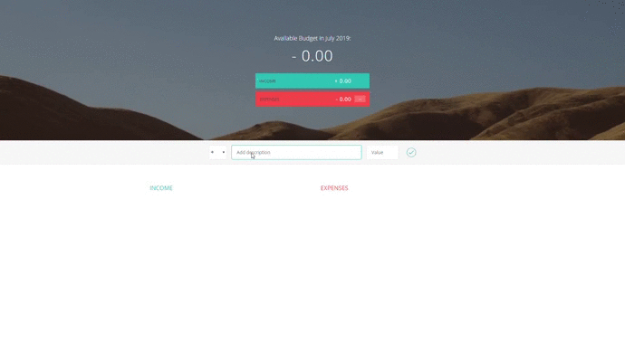

<h1>A Budget-App</h1>

 

This App keeps a track of your income and expenses and shows the net saving remaining. It also shows the percentage of deduction on each item spent on the overall income.

 
<h2>Demo<h2>

 

<h2> Download and Installation</h2>
<ul>
<li> Clone the repository</li>
<pre>https://github.com/mohammedabbas27/Budget-App.git</pre>
<li> Execution </li>
<pre>
Run the following file in any modern browser:
index.html
</pre>
</ul>

 
<small>© 2019 Mohammed Abbas.  All rights reserved.</small>
